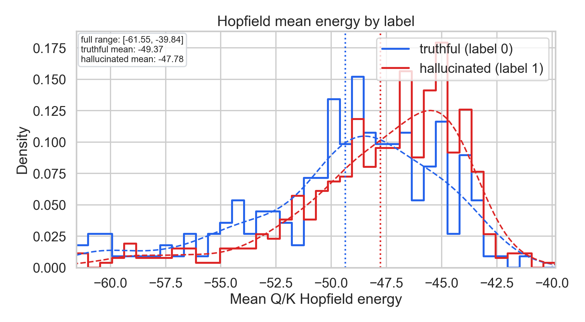
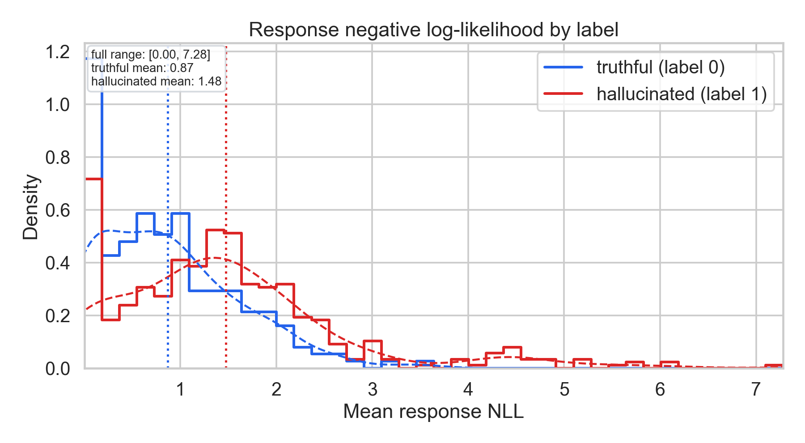
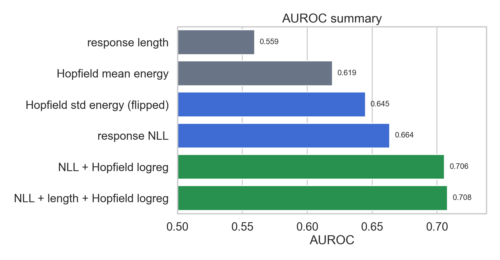

# Checkpoint 001: Q/K Hopfield Energy on SMILES/SQuAD Hallucinations

## Short Summary

We ran the first study-project experiment on the SMILES/SQuAD-derived
hallucination dataset using `Qwen/Qwen2.5-0.5B`. For each prompt-response pair,
we computed a standard response negative log-likelihood baseline and
attention-derived Q/K Hopfield-energy features from layers 12, 16, and 20.

The main result is that hallucinated answers have higher, less-negative mean
Hopfield energy than truthful answers:

| Label | Mean Hopfield Energy | Mean Response NLL |
| --- | ---: | ---: |
| Truthful (`0`) | `-49.37` | `0.87` |
| Hallucinated (`1`) | `-47.78` | `1.48` |

This is consistent with the working hypothesis that hallucinated responses
correspond to less stable or weaker associative retrieval in attention. Energy
alone is not stronger than likelihood, but it adds complementary signal.

## Setup

Dataset:

- Source file: SMILES/SQuAD-derived `dataset.csv`.
- Number of labeled examples: `689`.
- Labels: `206` truthful and `483` hallucinated.
- Hallucination scope: context-grounded hallucination, meaning an answer is
  unsupported by or contradictory to the supplied context.

Model:

- `Qwen/Qwen2.5-0.5B`.
- Frozen model; no fine-tuning.
- Max sequence length: `512`.
- Response scoring uses up to the last `32` response/content tokens, excluding
  the final end-of-text-like token when possible.

Signals:

- **Response NLL baseline:** mean negative log-likelihood over response tokens.
- **Hopfield energy:** for selected attention layers `(12, 16, 20)`, compute
  query/key vectors after RoPE and evaluate a causal log-sum-exp energy:

```text
E_t = -sqrt(d_head) * logsumexp((q_t · k_i) / sqrt(d_head), i <= t)
```

For each sample, the first implementation stores compact summaries over heads,
response tokens, and selected layers: mean, standard deviation, maximum, and
final-token energy statistics.

Evaluation:

- Scalar-score AUROC for response length, NLL, and individual energy features.
- Stratified 5-fold logistic regression for NLL, Hopfield features, and their
  combination.
- Metrics reported: accuracy, F1, AUROC.

## Main Metrics

| Method | Accuracy | F1 | AUROC |
| --- | ---: | ---: | ---: |
| Majority baseline | `0.7010` | `0.8242` | n/a |
| Response length scalar | `0.7010` | `0.8242` | `0.5595` |
| Response NLL scalar | `0.7010` | `0.8242` | `0.6635` |
| Hopfield mean energy scalar | `0.7083` | `0.8269` | `0.6194` |
| Response NLL logistic regression | `0.6865` | `0.8058` | `0.6613` |
| Hopfield logistic regression | `0.6880` | `0.7977` | `0.6309` |
| NLL + length + Hopfield logistic regression | `0.7242` | `0.8211` | `0.7081` |

The most important point is not that Hopfield energy beats NLL by itself. It
does not. The important point is that Hopfield energy moves in the expected
direction and improves the combined classifier beyond NLL and response length.

A quick ablation with the same logistic-regression protocol showed:

| Feature Set | AUROC |
| --- | ---: |
| NLL only | `~0.661` |
| NLL + length | `~0.685` |
| NLL + Hopfield | `~0.706` |
| NLL + length + Hopfield | `~0.708` |

This suggests the Hopfield features are not merely a response-length artifact.

## Illustrations

### Hopfield Energy Distribution



Hallucinated answers shift toward higher, less-negative energy. The
distributions overlap substantially, so this is not enough for a perfect
classifier, but the mean shift is clear. The plot uses shared histogram bins
over the full observed energy range.

### Response NLL Distribution



The ordinary likelihood baseline is still strong: hallucinated responses tend
to have higher response NLL.

### AUROC Summary



The combined result is the strongest in this first experiment.

## Interpretation

This checkpoint supports a modest but scientifically useful claim:

> Attention-derived Hopfield energy contains context-grounded hallucination
> signal in Qwen2.5-0.5B. Hallucinated answers have higher mean energy than
> truthful answers, and energy features add complementary information to a
> response-likelihood baseline.

The result should not yet be interpreted as proof that Hopfield energy is a
general hallucination detector. It has only been tested on one dataset, one
model, and one coarse layer/head aggregation. The current result is best viewed
as a positive first signal that justifies deeper ablations.

## Limitations

- Dataset is small: only `689` labeled examples.
- Dataset is imbalanced: about `70%` hallucinated.
- Current evaluation uses stratified folds, not yet group-aware context splits.
- The energy features average over all heads, which may dilute layer/head-specific
  signals.
- The current experiment tests context-grounded hallucination only, not
  open-domain false factual claims.

## Next Steps

Immediate next experiments:

- Run per-layer Hopfield ablations: evaluate layers separately instead of only
  `(12, 16, 20)` averaged together.
- Run per-head or top-head analysis to find whether the signal is concentrated
  in a small number of attention heads.
- Compare Q/K Hopfield energy against attention entropy and context-attention
  ratios.
- Add a hidden-state baseline in the same study repo so Hopfield energy is
  compared against both NLL and internal-state probing.
- Re-run evaluation with group-aware context splits to reduce repeated-context
  leakage.

Dataset expansion:

- Build a larger SQuAD v2-derived generated-answer dataset with the same prompt
  template and Qwen2.5-0.5B.
- Evaluate on HaluEval QA as a broader QA hallucination benchmark.
- Evaluate on RAGTruth for a stronger context-grounded/RAG hallucination test.
- Later test open-domain factuality transfer on TruthfulQA or FELM.

Model transfer:

- Start with Qwen2.5-0.5B only.
- Then test a larger Qwen checkpoint such as Qwen2.5-1.5B or 3B.
- Then test a different model family to check whether the energy shift is
  architecture-specific or transferable.

## Reproduction

Full experiment command:

```bash
uv run experiments/001_qwen05b_squad_hopfield.py \
  --data ./data/smiles_squad/dataset.csv \
  --device cuda
```

Generated files:

- `outputs/001_qwen05b_squad_hopfield/features.npz`
- `outputs/001_qwen05b_squad_hopfield/metrics.json`
- `outputs/001_qwen05b_squad_hopfield/summary.md`

Figure-generation command:

```bash
uv run scripts/make_checkpoint_001_figures.py \
  --features outputs/001_qwen05b_squad_hopfield/features.npz \
  --out-dir reports/figures
```

This regenerates:

- `reports/figures/energy_hist.png`
- `reports/figures/nll_hist.png`
- `reports/figures/auroc_bars.png`
- `reports/figures/stats.json`
